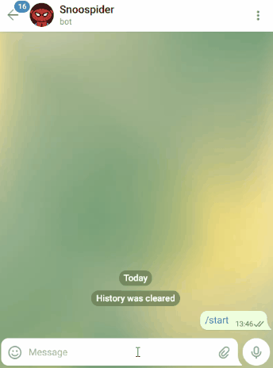

## 📝 Description

This application creates a telegram bot who scrap subredddits fetching threads with too many upvotes.</br>

### 📦 Packages
The packages used in this project were:
- **requests**: gets the page content as html 
- **beautiful Soup**: allows the navigation and extraction of relevant page contents
- **python-telegram-bot**: framework that implements telegram API to handle requests through pooling or webhook
- **Flask**: the docker container run in a heroku service using a free account who shutdown with 30 min of innactivity, was used flask to route a resource that can wake up the service easily
- **Gunicorn**: process incoming HTTP requests `concurrently`. the built-in Flask web server has `blocking` behavior and stops to answer while scraping is being executed

Package versions used and dependencies are listed ``requirements.txt`` 


### 💿 softwares<a id="Packages"></a>
To use this app is needed:
- [python3](https://www.python.org/downloads/)
- [Docker](https://www.docker.com/)
- [Heroku CLI](https://devcenter.heroku.com/articles/heroku-cli)
- [GIT](https://git-scm.com/book/en/v2/Getting-Started-Installing-Git)

## ⚙️Building app

### Clone project

Clone project:
```
$ git clone https://github.com/glauberdmo/desafios.git
```
and uses /crawlers/ as root for the next steps

### 📲Create a telegram bot
First create a bot through telegram app talking with @botfather, if you don't know how to do that follow the [official documentation](https://core.telegram.org/bots#3-how-do-i-create-a-bot)
you will need to make this step to get his token with telegram API

### Creates a new app in heroku:
**you can skip this section if wants to run it locally through docker or use other container based service**
```
$ heroku apps:create [APP]
```
and define this enviroment vars:

```
$ heroku config:set TOKEN=TELEGRAM_API_TOKEN_HERE
```

### 🐳 Creating image and running through Docker:
to create a new docker img, follow this cmds [(or create a pipeline and a app inside)](https://devcenter.heroku.com/articles/heroku-cli-commands#heroku-pipelines-add-pipeline):
```
docker build --tag telegram-bot .
docker run -e TOKEN=TELEGRAM_API_TOKEN_HERE -dp 80:80 telegram-bot
```
note: Heroku are not compatible with docker compose
Access your [localhost](https://localhost:80) to start the bot

### Deploying through Heroku
First you need go to ``Dockerfile`` and change ``80`` -> ``$PORT`` in row 11. Heroku define one port by dyno and needs to control it dynamically.
in your bash:

```
heroku container:push web -a telegram-bot-challenge
```
The last cmd calls the docker to create a new image and push to heroku service. We need to create a new image because the PORT change. If you know some way to improve it, open a issue!
Makes the deployment
```
heroku container:release web -a telegram-bot-challenge
```
Access his web

## 🕹 Using bot
To use the bot, send a message command follow this format: 
```
/npf | /nadaprafazer subrredit_name1 subrredit_name2 ...
```
the subrredits names can be separated with any symbol, except "_"


<table border="0">
 <tr>
    <td>This application creates a telegram bot who scrap subredddits fetching threads with too many upvotes.</br> 
    Was made as part of a challenge proposed by IdWall</br>
    <a href="#packages">Click here to see the content below.</a>    
    </td>
    <td></td>
 </tr>
</table>